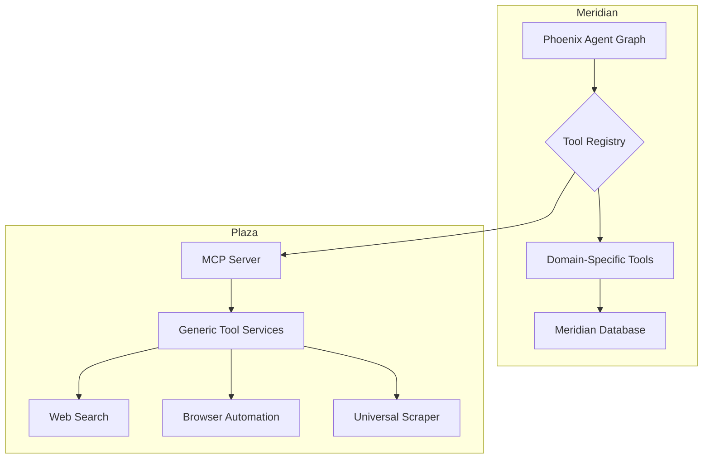

# Meridian: Porting Plan from `meridian-prime` (v1.1)

**Prepared:** 2026-02-24
**Deliverable:** `D-KP-M-01` (Phase 04 Knowledge Preservation)
**Artefact Path:** `docs/planning/artefacts/meridian_prime_porting_plan.md`

---

## 1. Executive Summary (v1.1)

This document provides the definitive, prioritised plan for porting high-value assets from `nizamiq/meridian-prime`. It has been updated to reflect a critical architectural decision: **all generic agentic tooling and MCP services will be extracted to the `nizamiq/Plaza` repository.**

`meridian` will now focus exclusively on its core domain: PBSA investment intelligence, deal management, and financial analytics. It will consume the generic tools (web search, browser automation, etc.) from Plaza as a service, rather than hosting them directly.

This separation of concerns is a significant improvement:

*   **`meridian`** becomes a pure, domain-specific application.
*   **`Plaza`** becomes the authoritative, licensable, and generic agentic tooling platform for the entire NizamIQ ecosystem.

**The `meridian-prime` codebase in numbers:**

| Metric | Value |
| :--- | :--- |
| Django Backend Apps | 46 |
| Domain Model Classes | 599 |
| Total User Stories | 126 |
| Total Estimated Effort (User Stories) | **883 story points** |
| Agent Tools (Phoenix) | 21 |
| MCP Microservices | 12 |

---

## 2. What Is Being Left Behind (Technical Debt Exclusion List)

This list remains unchanged. No technical debt will be ported to either `meridian` or `Plaza`.

| Debt Item | Source in `meridian-prime` | Reason for Exclusion |
| :--- | :--- | :--- |
| `django-tenants` schema-based multi-tenancy | `backend/` root config | Replaced by superior RLS row-level tenancy in `meridian`. |
| `safe_include` URL anti-pattern | `core/urls.py` (55 instances) | Silently swallows import errors, causing invisible feature failures at runtime. |
| Disabled OIDC / `django-allauth` | `settings.py` (commented out) | Replaced by the Zitadel OIDC integration already live in `meridian`. |
| Monolithic model files (48KB+) | `organizations/models.py` et al. | Must be decomposed; `meridian` already demonstrates the correct pattern. |
| Placeholder and mock tests | `tests/` (793 files, low effective coverage) | Only meaningful tests with real assertions will be ported. |

---

## 3. Revised Porting Framework: Meridian vs. Plaza

The core change is the re-routing of the AI and Agentic Framework. The work is now split between the two repositories.

### 3.1. `meridian`'s Scope: Domain-Specific Logic

`meridian` will absorb all the **domain-specific** intellectual property. This includes:

*   **P0 - Core IP & Engines:** All 22 stories (170 points) covering the PBSA Research Engine, Geographic Intelligence, PSI Scoring, and Financial Intelligence.
*   **P1 - High-Value Domain Features:** All 69 stories (522 points) covering Market Intelligence, Investment Decision Support, Analytics, CRM, VDR, and Stakeholder Management.
*   **Domain-Specific Agent Tools:** Tools that directly interact with the `meridian` database and business logic (e.g., `pbst_tools.py`, `database_tools.py`).
*   **The Phoenix Agent Graph:** The agent orchestration logic will remain in `meridian`, but it will now call out to Plaza for generic tools.

### 3.2. `Plaza`'s Scope: Generic Agentic Tooling

`Plaza` will absorb all the **generic, domain-agnostic** tooling from `meridian-prime`. This aligns with Plaza's charter to be the central tooling platform.

*   **MCP Framework:** The core `mcp_framework` (3,108 lines) will be ported to `Plaza`.
*   **Generic MCP Services:** The following services from `meridian-prime/mcp_services/` will be ported to `Plaza`:
    *   `universal_scraper`
    *   `playwright_tool`
    *   `search_tool` (Exa, Serper, Perplexity)
    *   `news_search`
    *   `linkedin_data`
    *   `datetime_tool`
*   **Generic Agent Tools:** The wrappers in `mcp_tools.py` that call these services.

---

## 4. The AI & Agentic Framework (Revised Cross-Cutting Plan)

This section is the core of the revision. The agentic framework is now distributed.

### 4.1. Target Architecture

### 4.2. `meridian` Responsibilities (The "Brain")

*   **Host the Phoenix Agent:** The LangGraph orchestration logic (`agents/phoenix/graph.py`) remains in `meridian`.
*   **Maintain the Tool Registry:** The `ToolRegistry` will be configured to know about both local (domain-specific) tools and remote (Plaza) tools.
*   **Implement Domain-Specific Tools:** All tools that query the `meridian` database or execute its business logic (e.g., `get_organization`, `calculate_psi_score`) will be implemented as local Python functions within `meridian`.

### 4.3. `Plaza` Responsibilities (The "Hands")

*   **Host Generic Tools:** Port the generic MCP services (scraper, search, browser) from `meridian-prime` to `Plaza`'s TypeScript codebase. This work is already partially complete as per Plaza's Phase 01 plan.
*   **Expose Tools via MCP:** Provide a stable, versioned MCP API for these tools.
*   **Manage Tooling Infrastructure:** Handle the complexities of running Playwright, managing search API keys, and ensuring the reliability of these generic services.

---

## 5. Revised Phased Execution Plan

The overall timeline remains similar, but the workstreams are now split across two repositories.

| Phase | Duration | `meridian` Deliverables | `Plaza` Deliverables | Stories Addressed |
| :--- | :--- | :--- | :--- | :--- |
| **Phase 4a: Core Domain Model** | 3–4 weeks | All 599+ models ported, tenant-scoped, and migrated | - | P2 (US018, US026, US028) |
| **Phase 4b: Financial & Research Engines** | 2–3 weeks | PSI Scorer, Yield Engine, IC Pack Builder, Financial Metrics | - | P0 (22 stories, 170 pts) |
| **Phase 4c: Agentic Framework Integration** | 4–5 weeks | Phoenix agent, domain-specific tools, updated tool registry that calls Plaza | Port all generic MCP services from `meridian-prime` | Cross-cutting |
| **Phase 4d: Intelligence & Analytics** | 4–6 weeks | Market intelligence, investment decision support, analytics engine | - | P1 (selected stories) |
| **Phase 4e: CRM, VDR & Deals** | 3–4 weeks | VDR, deal management, CRM automation, stakeholder management | - | P1 (remaining stories) |
| **Phase 4f: UI/UX Polish** | 2–3 weeks | Motion design, micro-interactions | - | P3 (10 stories, 46 pts) |

---

## 6. Conclusion (v1.1)

This revised plan provides a much cleaner separation of concerns and aligns perfectly with the ecosystem strategy of centralizing generic capabilities in `Plaza`. `meridian` can now focus on being a best-in-class PBSA investment platform, consuming world-class agentic tooling from `Plaza`.

This change de-risks the `meridian` project by offloading the complexity of maintaining generic tooling, and it enriches the `Plaza` project by giving it a clear backlog of battle-tested tools to port from `meridian-prime`.

The next step is to commit this revised plan to both repositories and begin execution of Phase 4a in `meridian` and Phase 4c in `Plaza` concurrently.
